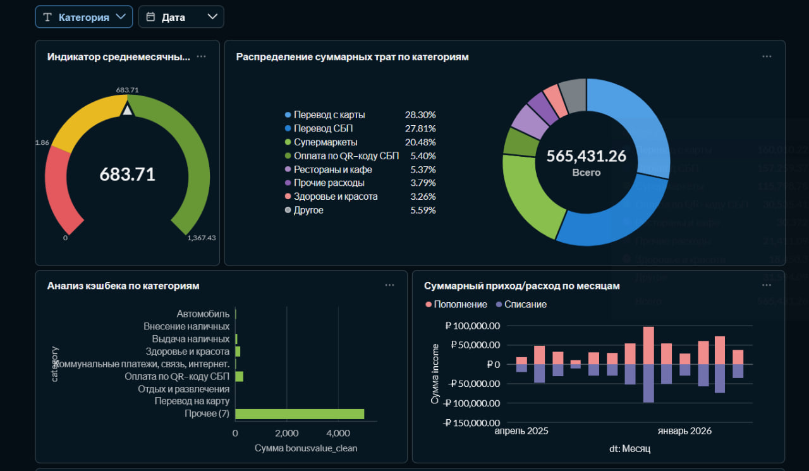
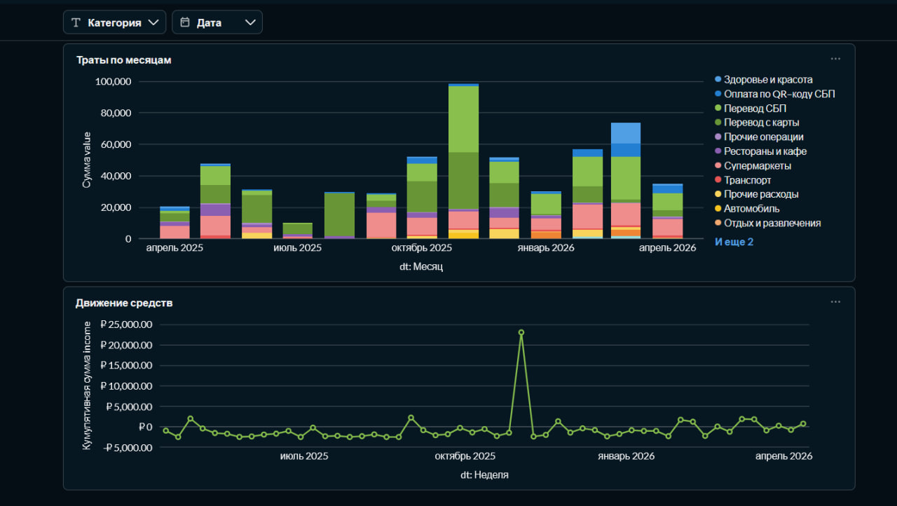
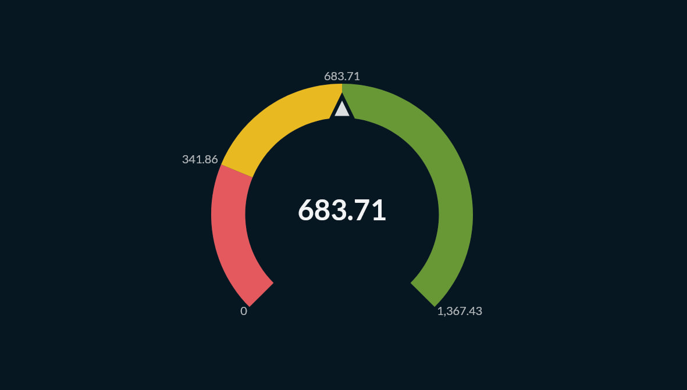
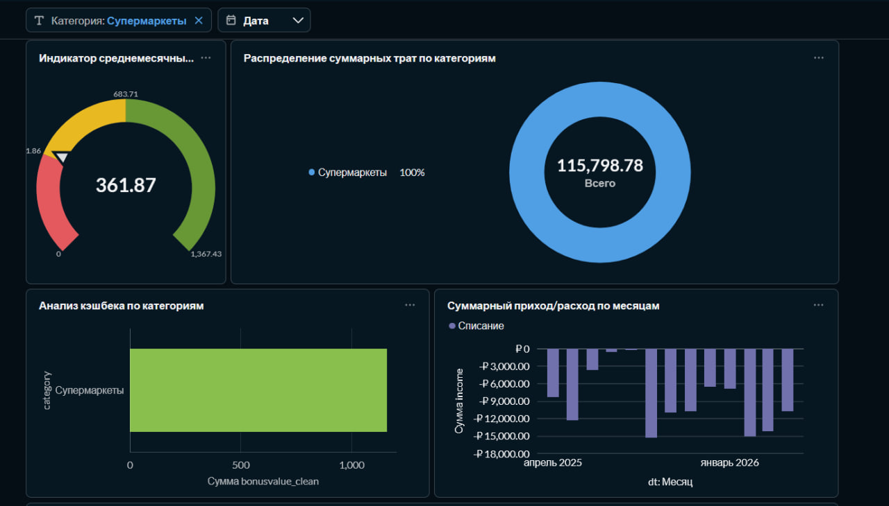

# Анализ банковских транзакций в Metabase
## 1. Подготовка данных (SQL)

Для корректной визуализации данные были предобработаны с помощью SQL-запроса. Основные задачи: приведение даты к формату `DATE`, конвертация сумм в числовой тип и инверсия знака для расходов.

```sql
SELECT
  *,
  STR_TO_DATE(t.transactiondate, '%d.%m.%Y') AS DT,
  CONVERT(t.amount, DECIMAL(10, 2)) AS `value`,
  IF (t.type = "Списание", CONVERT(t.amount, DECIMAL(10, 2)) * -1, CONVERT(t.amount, DECIMAL(10, 2))) as `income`,
  CAST(REPLACE(t.bonusValue, '+', '') AS DECIMAL(10, 2)) AS bonusValue_clean
FROM
  `statement_01_01_2025_31_12_2025_20260412111310` AS t;
```


## 2\. Дашборд «Анализ транзакций»




## Основные визуализации

* **Индикатор среднемесячных трат:** Позволяет быстро оценить средний уровень расходов за исследуемый период.

* **Распределение суммарных трат по категориям:** Наглядное соотношение категорий в общем объеме расходов.

* **Суммарный приход/расход по месяцам:** Столбчатая диаграмма для сравнения входящих и исходящих денежных потоков.

* **Движение средств:** График, показывающий динамику остатка средств, накопленную по неделям.

* **Траты по месяцам:** Накопительная гистограмма для анализа изменения структуры расходов по категориям во времени.

* **Анализ кэшбека по категориям:** Визуализация эффективности бонусных начислений по разным типам операций.


-----

## 3. Интерактивность и фильтры

На дашборде настроены глобальные фильтры по **Дате** и **Категории**. Также реализована система **кросс-фильтров**: при клике на сектор диаграммы или столбец гистограммы весь дашборд автоматически фильтруется по выбранному значению.

**ДО:**


**ПОСЛЕ:**



-----

## 4\. Результаты

Проект в формате PDF:

  * 

-----
