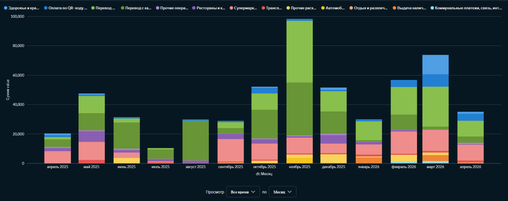
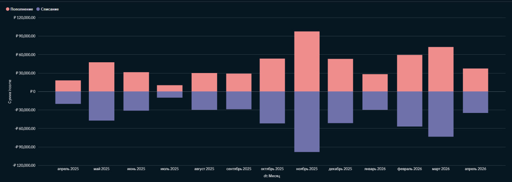
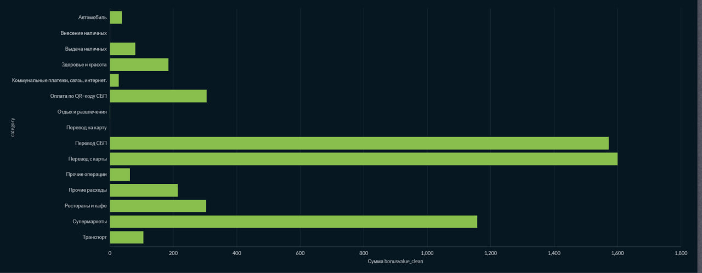

# Анализ транзакций в Metabase: Итоговый отчет

## 1\. Общий вид дашборда


-----

## 2\. Подготовка данных (Core SQL)

```sql
SELECT
  *,
  STR_TO_DATE(t.transactiondate, '%d.%m.%Y') AS DT,
  CONVERT(t.amount, DECIMAL(10, 2)) AS `value`,
  IF (t.type = "Списание", CONVERT(t.amount, DECIMAL(10, 2)) * -1, CONVERT(t.amount, DECIMAL(10, 2))) as `income`,
  CAST(REPLACE(t.bonusValue, '+', '') AS DECIMAL(10, 2)) AS bonusValue_clean
FROM
  `statement_01_01_2025_31_12_2025_20260412111310` AS t;
```

-----

## 3\. Детальный анализ визуализаций

### 3.1. Индикатор среднемесячных трат

  * **Назначение:** Оценка среднего чека расходов.
  * **Логика запроса:** Агрегация `Average` по полю `value` с фильтрацией по типу операции.


### 3.2. Распределение суммарных трат по категориям (Pie)

  * **Назначение:** Выявление самых затратных категорий.
  * **Логика запроса:** `SUM(value)` с группировкой по `category`.


### 3.3. Траты по месяцам (Накопительная гистограмма)

  * **Назначение:** Анализ изменения структуры расходов во времени.
  * **Логика запроса:** Группировка по месяцу и категории, суммирование транзакций.



### 3.4. Суммарный приход/расход по месяцам

  * **Назначение:** Сравнение денежных потоков.
  * **Логика запроса:** Группировка по месяцу, серия данных по полю `type`, суммирование `income`.



### 3.5. Движение средств (Кумулятивная сумма)

  * **Назначение:** Отслеживание динамики баланса.
  * **Логика запроса:** Двойная группировка (день -\> неделя) с использованием функции накопления.


### 3.6. Анализ кэшбека по категориям

  * **Назначение:** Оценка выгоды по категориям.
  * **Логика запроса:** `SUM(bonusValue_clean)` с группировкой по категориям.



-----

## 4\. Проверка интерактивности (Кросс-фильтры)
  * **Состояние ДО:** 
  
  * **Состояние ПОСЛЕ:** 
  
-----

## 5\. Выгрузка

Результаты работы также доступны в формате PDF: https://github.com/Turik06/Infographics-data_visualization/blob/master/hw_base/Metabase.pdf

-----
